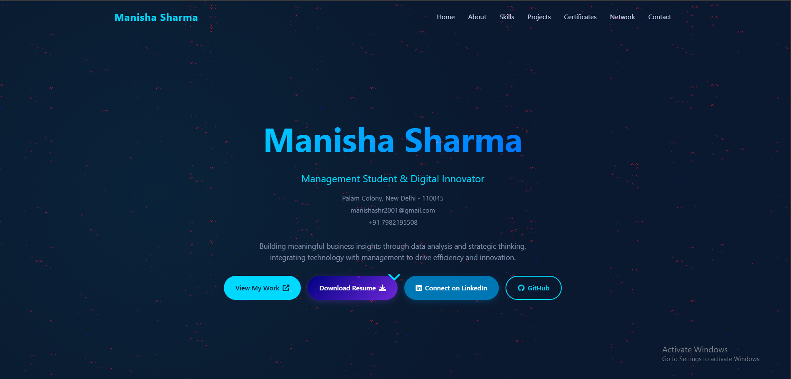
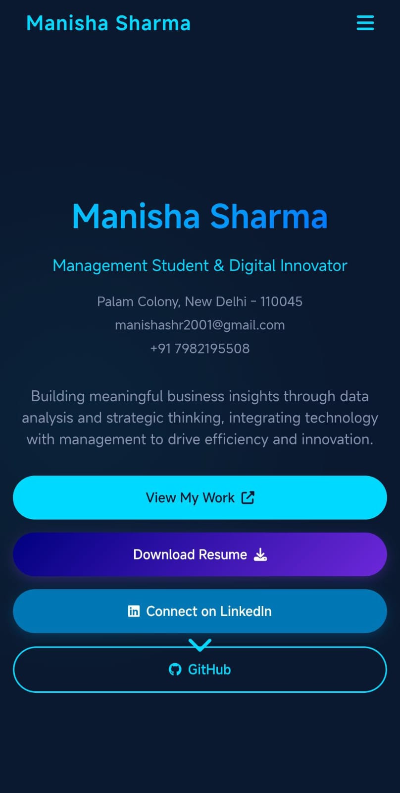

<h2 align="center">
  🌐 Manisha Sharma - Personal Portfolio <br/>
  <a href="https://MANISHA088.github.io/My-Portfolio/" target="_blank">Manisha</a>
</h2>
<div align="center">
  
</div>

# 


[](https://www.linkedin.com/in/manisha-da08/)
[](https://github.com/MANISHA088)

A modern and responsive **personal portfolio website** built using **HTML, CSS, and JavaScript**, designed to showcase my skills, education, experience, projects, and professional journey.

---

## 📸 Demo



<!--<p align="center">
  
</p> -->

---

## ✨ Features

⚡️ Fully Responsive Design  
⚡️ Smooth Scroll & Section Navigation  
⚡️ Animated Skill Progress Bars  
⚡️ Tabbed Experience/Education Section  
⚡️ Interactive Hover Effects  
⚡️ Contact Form & Social Links  

---

## Why do you need a portfolio?

- Professional way to showcase your work
- Increases your visibility and online presence
- Shows you’re more than just a resume

## Prerequisites

Before you begin, ensure you have met the following requirements:

* [Git](https://git-scm.com/downloads "Download Git") must be installed on your operating system.


## 📂 Project Structure

```bash
├── index.html       # Main HTML file
├── style.css        # Styling (colors, layout, responsiveness)
├── script.js        # Interactivity (tabs, animations, navbar)
└── assets/          # Images, certificates, and other media
```

## Installing vCard

To install, follow these steps:

Linux and macOS:

```bash
sudo git clone https://github.com/MANISHA088/My-Portfolio.git
```

Windows:

```bash
git clone https://github.com/MANISHA088/My-Portfolio.git
```

## 📬 Contact

If you want to contact me you can reach me at [Twitter](https://www.x.com/codewithsadee_), [Email](mail to: manishashr2001@gmail.com ), [LinkedIn](https://www.linkedin.com/in/manisha-da08)

## License

MIT

### Would you like me to also **add a "Contributing" section** (like in open-source repos) or keep it minimal since it’s a personal portfolio?
